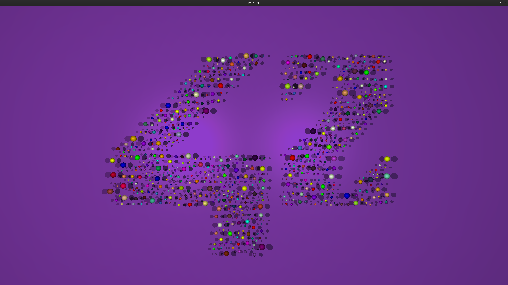
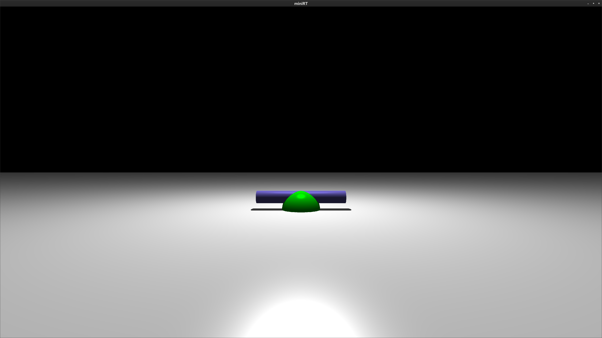
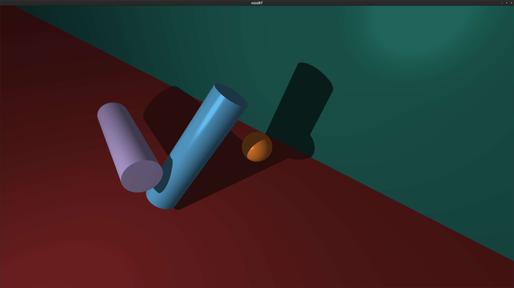
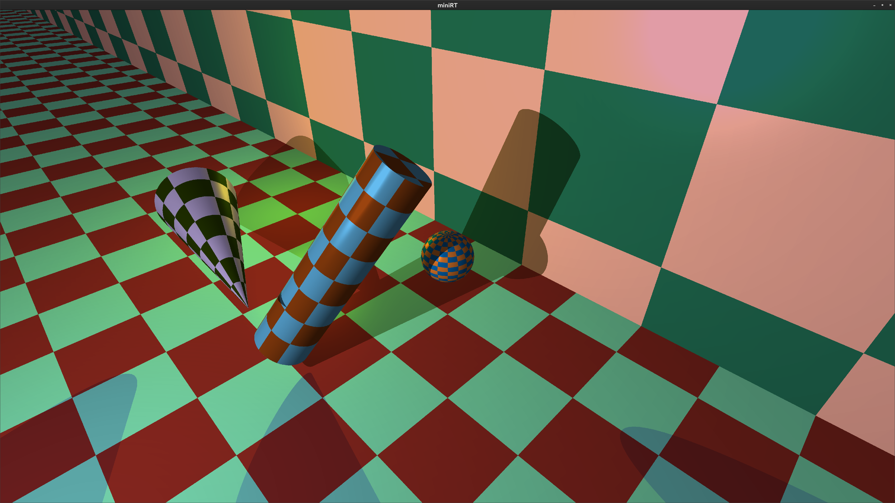
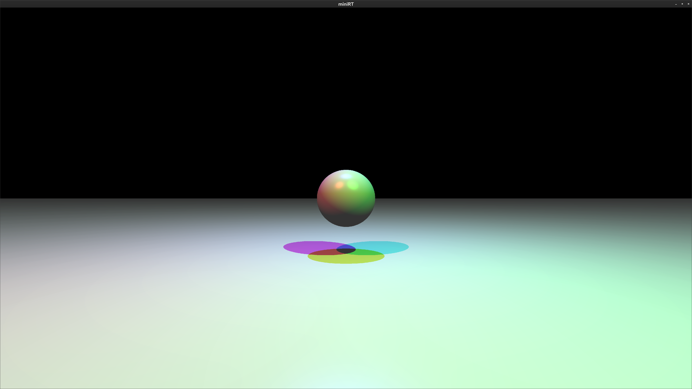

# MiniRT

## 🪧 Overview
### Description
This project is an introduction to the beautiful world of Raytracing.
Once completed you will be able to render simple Computer-Generated-Images and you
will never be afraid of implementing mathematical formulas again.
Our first raytracer handle the followings:
* Ambient, diffuse and specular lightning (phong effect)
* Multiple lights colors and intensity
* The followings primitive objects : Planes, Spheres, Cylinders and Cones
* Texture map and bump map

### Goal
The goal of the program is to generate images using the Raytracing. Those computer-generated images will each represent a scene, as seen from a specific angle and position, defined by simple geometric objects, and each with its own lighting system.

## 📷 Preview






## 🚀 Getting Started

### Installation
1. Clone the project.
```
git clone git@github.com:shatilovdr/miniRT.git
```
2. Navigate to the project directory.
```
cd miniRT
```
3. Compile the MiniRT.
```
make
```

## 🕹 Usage
1. Run the MiniRT with a [scenes](scenes/).
```
./minirt scenes/5_multi.rt
```
2. Press key `ESC` to quit 

